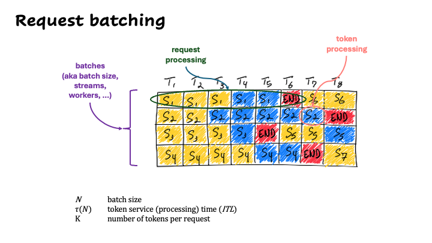
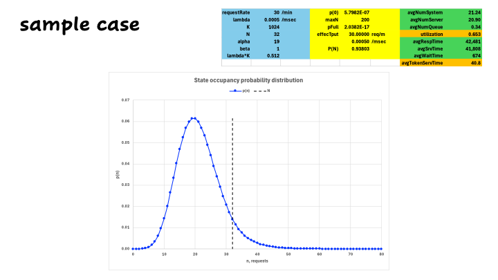

# Inference system optimizer

The inference system optimizer assigns GPU types to inference model servers and decides on the number of replicas for each model for a given request traffic load and classes of service, as well as the batch size.

Decision variables

For each pair of (class of service, model):

- gpuProfile: the GPU type allocated
- numReplicas: the number of replicas
- batchSize: the batch size, given continuous batching

## Example 1: Unlimited accelerators

## Example 2: Limited accelerators

## Example 3: Load change - Unlimited accelerators

